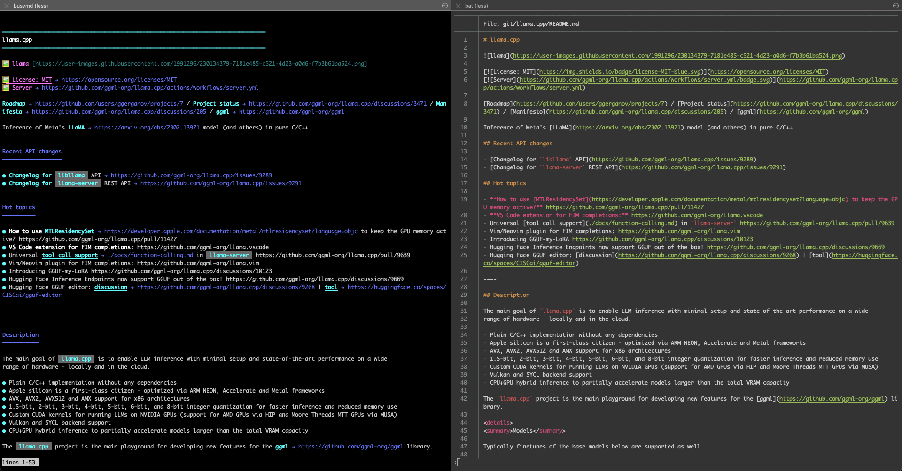
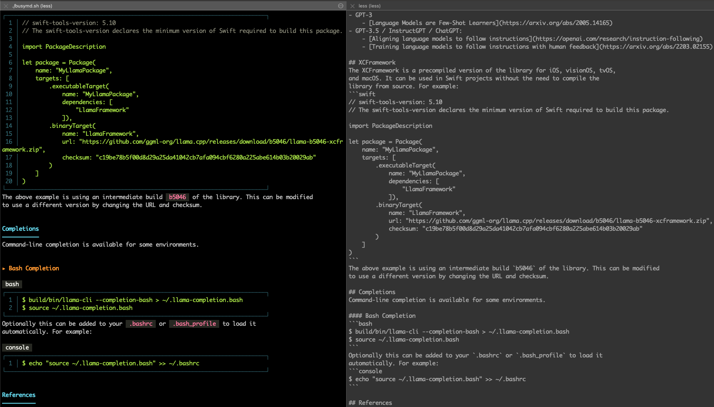

# busymd

A **pure bash markdown viewer** for the terminal. Zero dependencies. Works everywhere.

### Comparison: busymd vs bat


*Left: **busymd** (pure bash, zero dependencies) | Right: **cat/less***


*Left: **busymd** | Right: **cat/less***

### Features

- **Syntax highlighting** — Headers, lists, code blocks, links, images, tables, and more
- **Pure bash** — No Python, Ruby, Node.js, or Go. Just bash.
- **Zero dependencies** — Works on busybox, Alpine, anywhere with bash
- **Portable** — Drop it in as a shell function or standalone script
- **Minimal** — Under 300 lines of code

### Usage

**View a markdown file:**
```bash
busymd.sh README.md
```

**Pipe from stdin:**
```bash
cat README.md | busymd.sh
echo "# Hello" | busymd.sh
curl -s https://example.com/README.md | busymd.sh
```

**Skip the pager (disable lazy loading):**
```bash
busymd.sh --no-pager README.md
```

### What it renders

- Headers (all 6 levels)
- **Bold**, *italic*, ***bold+italic***, ~~strikethrough~~
- `inline code` and fenced code blocks with syntax highlighting
- Lists (ordered, unordered, nested, task lists)
- Links and images
- Tables
- Blockquotes
- Horizontal rules
- Admonitions (`!!! note`, `!!! warning`, etc.)

### Installation

**Use as a bash function (recommended):**
```bash
# Add to your ~/.bashrc or ~/.zshrc
source /path/to/busymd.sh
# Now you can use 'busymd' directly
```

Or as a one-liner function:
```bash
# Minimal wrapper - no sourcing needed
busymd() { bash /path/to/busymd.sh "$@"; }
```

**Install as a standalone command:**
```bash
curl -sL https://raw.githubusercontent.com/avilum/busymd/refs/heads/master/busymd.sh -o ~/.local/bin/busymd && chmod +x ~/.local/bin/busymd
```

**Or just download and run:**
```bash
wget https://raw.githubusercontent.com/avilum/busymd/refs/heads/master/busymd.sh
chmod +x busymd.sh
./busymd.sh README.md
```

### Navigation

When using the pager (less), you can:

| Key | Action |
|-----|--------|
| `g` / `G` | Go to beginning / end |
| `j` / `k` | Scroll down / up |
| `Space` | Page down |
| `/pattern` | Search forward |
| `n` / `N` | Next / previous match |
| `q` | Quit |

### Why?

Sometimes you're on a minimal system. Sometimes you don't want to install Python + dependencies. Sometimes you just want to read a README without leaving the terminal.

**busymd** works on:
- Alpine Linux
- Busybox
- Docker containers
- Old servers
- Your laptop
- Pretty much anywhere with bash

### Examples

```bash
# Quick preview of any GitHub repo's README
curl -s https://raw.githubusercontent.com/sharkdp/bat/master/README.md | busymd.sh

# Source it once in your shell, use it anywhere
source ~/bin/busymd.sh
busymd README.md
cat CHANGELOG.md | busymd

# Or with an alias for cleaner syntax
source ~/bin/busymd.sh && alias md='busymd'
md README.md

# One-liner wrapper function
busymd() { bash ~/bin/busymd.sh "$@"; }
busymd CHANGELOG.md

# Chain with other tools
find . -name "*.md" -exec busymd.sh {} \;
```

### Requirements

- Bash 4.0+
- A terminal that supports ANSI colors

That's it. No pip, npm, gem, cargo, or go install required.

### License

MIT

### Inspiration

Inspired by [bat](https://github.com/sharkdp/bat), [glow](https://github.com/charmbracelet/glow), and the Unix philosophy of doing one thing well.

